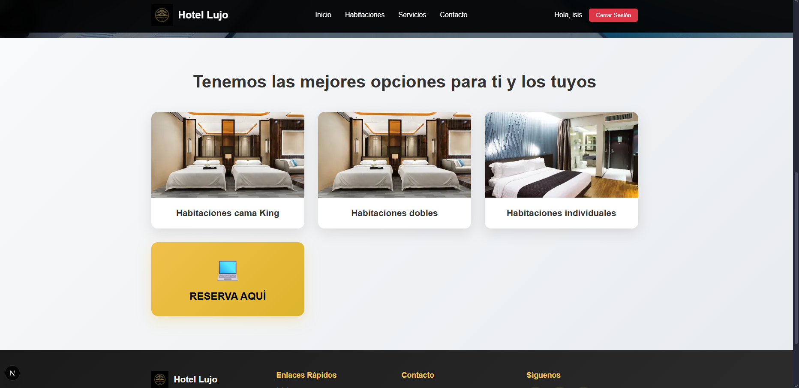
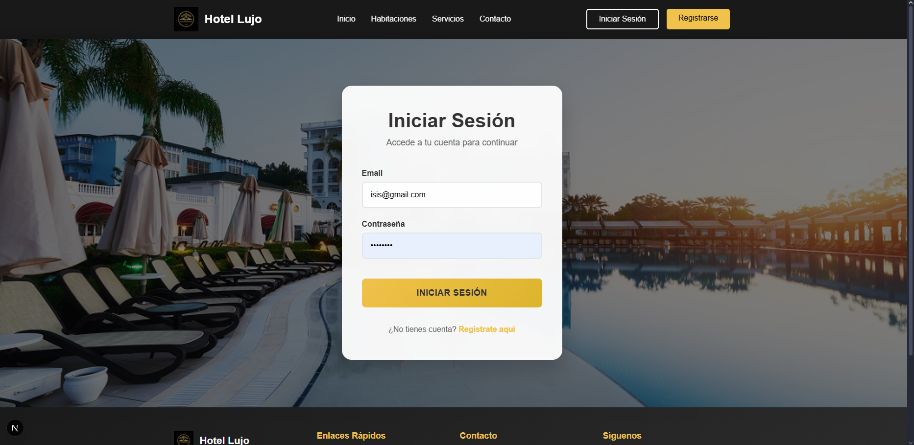
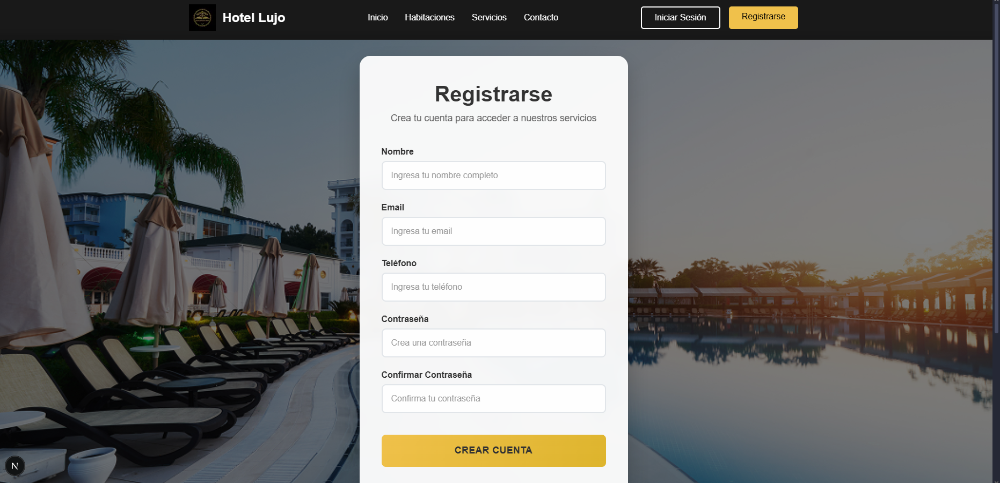

# 🏨 Sistema de Reserva Hotelera - Hotel Lujo

## 📋 Glosario y Enlaces

### 📊 Gestión de Proyecto
- [**Product Backlog**](https://docs.google.com/spreadsheets/d/15GA4Cv3b-udAveNFdLNK81-hSkMyojW8/edit?rtpof=true&sd=true&gid=494613536#gid=494613536) - Lista de funcionalidades y tareas del proyecto
- [**Roadmap**](https://miro.com/app/board/uXjVJOM7k8s=/?share_link_id=622137547940) - Cronograma y planificación del desarrollo
- [**Trello Board**](https://trello.com/b/Lg88n8Uv/gestion-de-reserva-hotelera) - Gestión de tareas y seguimiento ágil
- [**Definition of Done**](https://docs.google.com/spreadsheets/d/1pJ8wre588Y_WAlgj9sZNhEdSU5WUFpugdi221f0Dun8/edit?usp=sharing) - Criterios de finalización de tareas

### 🎨 Diseño y Prototipado
- [**Prototipo Figma**](https://www.figma.com/design/yrJYSPD6jdavaChbRDUoTU/HOTEL-PACIFIC-REEF?node-id=2-21&t=sAyOu9li3xRj8hqu-0) - Diseño de interfaces y experiencia de usuario

### 📐 Diagramas y Arquitectura
- [**Diagrama de Clases**](https://lucid.app/lucidchart/250fefda-27fd-4723-b6c9-e5de9dde8810/edit?viewport_loc=-2204%2C-445%2C4431%2C2535%2CHWEp-vi-RSFO&invitationId=inv_4a1d718c-bc96-4d3c-851e-1770ebbf40e5) - Estructura de clases del sistema
- [**Diagrama de Casos de Uso**](https://lucid.app/lucidchart/23581100-54f8-4558-b358-26cd44b299b7/edit?viewport_loc=-1374%2C-534%2C3651%2C2089%2C.Q4MUjXso07N&invitationId=inv_c547442e-935d-4f7c-941b-fa6217093d25) - Funcionalidades y actores del sistema
- [**Vista de Proceso - Diagrama de Actividad**](https://lucid.app/lucidchart/07dc3afc-1e0e-4841-a67f-4b6a3530c7f4/edit?viewport_loc=-3404%2C-1607%2C6267%2C3585%2C0_0&invitationId=inv_c8d57ac0-0ba8-4d84-8bff-16b877913654) - Flujo de procesos del sistema

### 💻 Código y Repositorio
- [**Repositorio GitHub**](https://github.com/GisDuoc/Sistema-de-Reserva-Hotelera) - Código fuente y control de versiones

---

## 📂 Documentación del Equipo

### 🗂️ Unidad Drive Equipo 5
Acceso completo a la documentación, entregables y recursos del proyecto:

📁 [**Drive Equipo 5**](https://drive.google.com/drive/u/2/folders/1RE3CXzcX5rmBRFIaUbbf0syftUjtFyQd)

*Contiene todos los documentos, presentaciones, análisis y material adicional del proyecto.*

---

## 👥 Equipo de Desarrollo

**Equipo 5 - Ingeniería de Software**
- Desarrollo Frontend con Next.js y React
- Diseño UX/UI basado en prototipo Figma  
- Metodología Ágil con Scrum
- Gestión de proyecto con herramientas colaborativas

---

## 📋 Descripción

Sistema de gestión hotelera desarrollado con **Next.js 15** y **React 19** que permite a los usuarios registrarse, iniciar sesión y explorar las diferentes opciones de habitaciones del hotel. La aplicación cuenta con una interfaz moderna y elegante que refleja el lujo y la comodidad del establecimiento.

### ✨ Características Principales

- **🔐 Sistema de Autenticación**: Registro e inicio de sesión de usuarios
- **💾 Gestión Local**: Almacenamiento temporal con localStorage (preparado para base de datos)
- **📱 Diseño Responsive**: Interfaz adaptable a todos los dispositivos
- **🎨 UI/UX Moderno**: Diseño basado en prototipo Figma con efectos glassmorphism
- **⚡ Alto Rendimiento**: Optimizado con Next.js y componentes atomizados

## 🛠️ Tecnologías Utilizadas

### Frontend
- **Next.js 15** - Framework de React con App Router
- **React 19** - Biblioteca de JavaScript para interfaces de usuario
- **SASS/SCSS** - Preprocesador CSS para estilos avanzados
- **JavaScript ES6+** - Lenguaje de programación principal

### Herramientas de Desarrollo
- **ESLint** - Linter para mantener calidad de código
- **Git & GitHub** - Control de versiones y colaboración
- **Figma** - Diseño y prototipado de interfaces

### Arquitectura
- **Componentes Atomizados** - Estructura modular y reutilizable
- **CRUD Simulado** - Sistema preparado para integración con base de datos
- **localStorage** - Persistencia temporal de datos
- **App Router** - Enrutamiento moderno de Next.js

## 🖼️ Capturas de Interfaz

### Página Principal


*Imagen de la página principal con hero section y galería de habitaciones*

### Formulario de Login

*Interfaz de inicio de sesión con fondo del hotel*

### Formulario de Registro

*Formulario de registro de nuevos usuarios*


## 🚀 Instalación y Uso

### Prerrequisitos
- Node.js 18+ 
- npm o yarn

### Pasos de Instalación

1. **Clonar el repositorio**
   ```bash
   git clone https://github.com/GisDuoc/Sistema-de-Reserva-Hotelera.git
   cd Sistema-de-Reserva-Hotelera/reserva_hotelera
   ```

2. **Instalar dependencias**
   ```bash
   npm install
   ```

3. **Instalar SASS**
   ```bash
   npm install sass --save-dev
   ```

4. **Ejecutar en modo desarrollo**
   ```bash
   npm run dev
   ```

5. **Abrir en el navegador**
   ```
   http://localhost:3000
   ```

### Comandos Disponibles

```bash
npm run dev      # Servidor de desarrollo
npm run build    # Construir para producción
npm run start    # Servidor de producción
npm run lint     # Verificar código con ESLint
```

## 📁 Estructura del Proyecto

```
reserva_hotelera/
├── src/
│   ├── app/
│   │   ├── login/                 # Página de inicio de sesión
│   │   │   ├── page.js
│   │   │   └── page.module.scss
│   │   ├── registro/              # Página de registro
│   │   │   ├── page.js
│   │   │   └── page.module.scss
│   │   ├── layout.js              # Layout principal
│   │   ├── page.js                # Página principal
│   │   ├── page.module.scss       # Estilos página principal
│   │   └── globals.css            # Estilos globales
│   ├── components/
│   │   ├── Header.js              # Componente header
│   │   ├── Header.module.scss
│   │   ├── Footer.js              # Componente footer
│   │   └── Footer.module.scss
│   └── utils/
│       └── localStorage.js        # Gestión de datos locales
├── public/
│   └── assets/
│       └── images/                # Imágenes del hotel
├── package.json
└── README.md
```

## 🔧 Funcionalidades Implementadas

### 🔐 Sistema de Autenticación
- **Registro de usuarios** con validación de formularios
- **Inicio de sesión** con verificación de credenciales
- **Gestión de sesiones** con localStorage
- **Cierre de sesión** y limpieza de datos

### 🎯 Gestión de Datos (CRUD Simulado)
- **Crear** nuevos usuarios
- **Leer** datos de usuarios existentes
- **Actualizar** información de usuarios
- **Eliminar** usuarios del sistema
- **Autenticación** y validación de credenciales

### 🎨 Interfaz de Usuario
- **Diseño responsive** para móviles, tablets y desktop
- **Componentes reutilizables** y atomizados
- **Efectos visuales** modernos con glassmorphism
- **Navegación fluida** entre páginas
- **Validaciones en tiempo real** en formularios

## 📄 Licencia

Este proyecto fue desarrollado como parte del curso de Ingeniería de Software en DUOC UC.

---

**🚀 Estado del Proyecto:** ✅ **Completado - Fase 1**

*Aplicación funcional con sistema de autenticación y gestión de usuarios. Preparada para integración con base de datos en fases futuras.*
